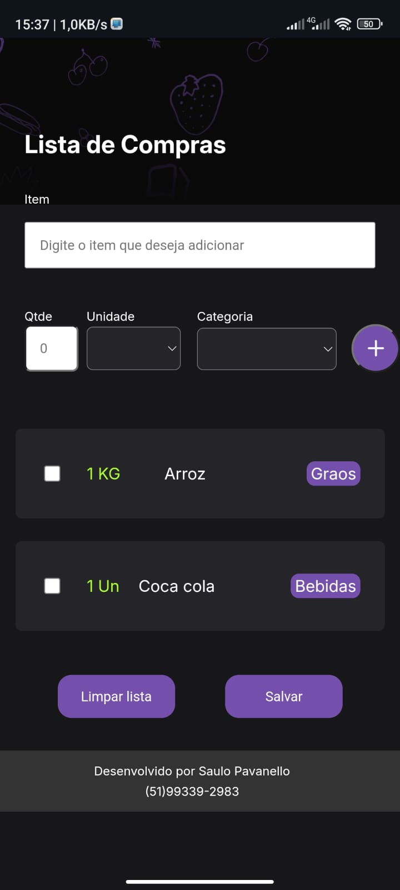

🛒 Lista de Compras Mobile
Lista de Compras Mobile é uma aplicação web prática e intuitiva para criar, organizar e compartilhar listas de compras. Com um design minimalista e funcional, o projeto foi desenvolvido com foco em facilitar o dia a dia, permitindo salvar listas em PDF e compartilhar com quem você quiser!

🌟 Funcionalidades
✅ Criação de listas de compras personalizadas.
✅ Validação de quantidade mínima (não é permitido valores negativos).
✅ Opção para salvar listas em formato PDF.
✅ Compartilhamento simples e rápido.
✅ Design responsivo para funcionar em dispositivos móveis e desktops.
🚀 Tecnologias Utilizadas
HTML5 : Estruturação do projeto.
CSS3 : Estilização e layout responsivo.
JavaScript : Funcionalidades e validações.
🎯 Como usar
Acesse o projeto em: Lista de Compras Mobile
Crie sua lista de compras adicionando os itens e detalhes.
Clique em Salvar PDF para baixar sua lista e compartilhar com quem desejar.
Aproveite a praticidade no seu dia a dia!
🛠️ Como Executar o Projeto Localmente
Clonar este repositório:
bater

Copiar

Editar
git clone https://github.com/seu-usuario/lista-de-compras-mobile.git
Acesse a pasta do projeto:
bater

Copiar

Editar
cd lista-de-compras-mobile
Abra o arquivo index.htmlno seu navegador favorito.
📄 Licença
Este projeto está sob licença MIT. Sinta-se à vontade para usar, modificar e compartilhar!

🤝 Contribuições
Contribuições são bem-vindas! Caso tenha sugestões, encontre bugs ou deseje adicionar novas funcionalidades, sinta-se à vontade para abrir um issue ou enviar um pull request.

🙌 Agradecimentos
Agradeço à Alura por fornecer os conhecimentos necessários para o desenvolvimento deste projeto.

👨‍💻 Desenvolvido por:
Saulo Pavanello
📞 (51) 99339-2983
📧 mxsgamejps@email .com